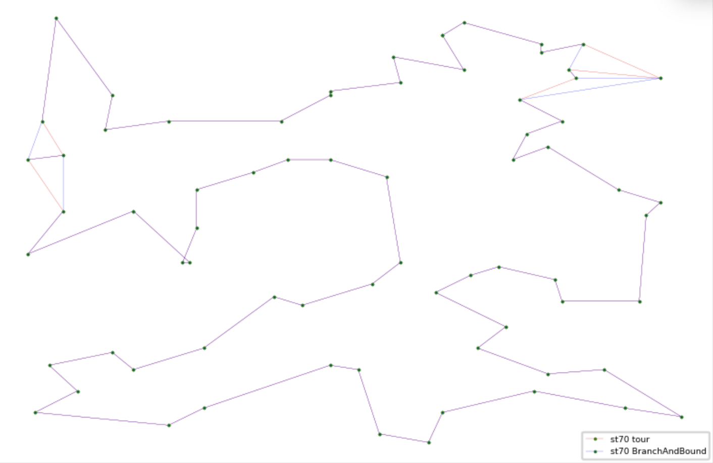
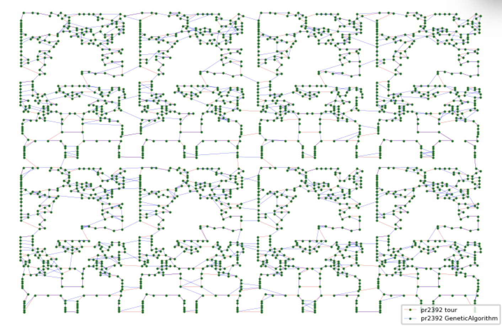
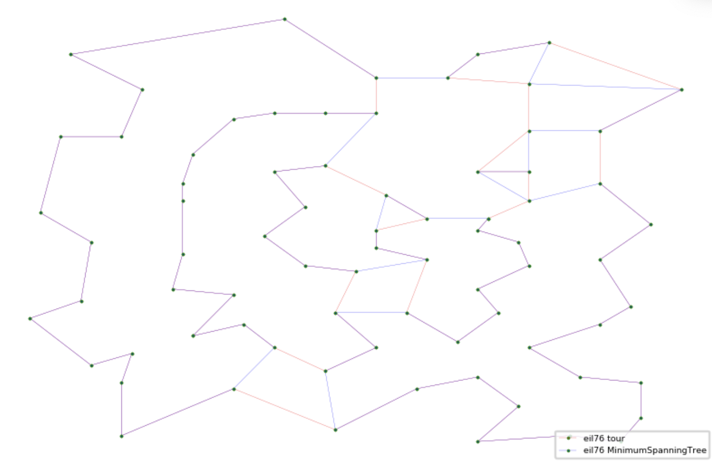
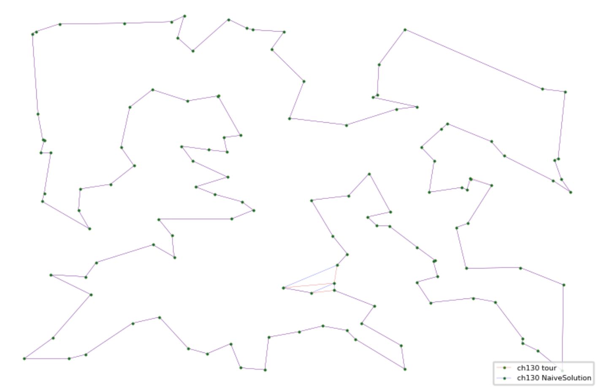
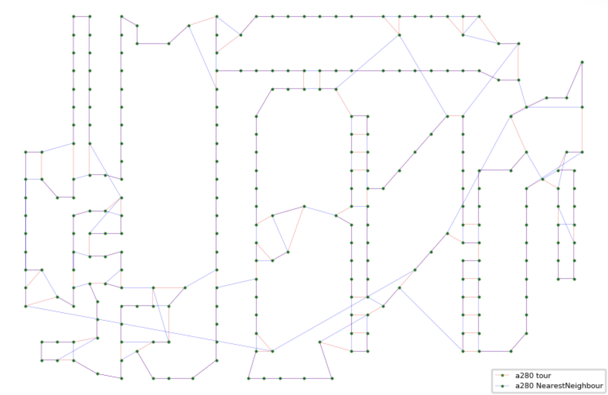
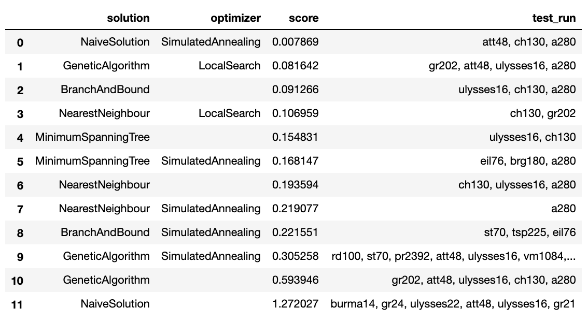

# Курсовая работа 
***

 __Тема:__ Фреймворк для решения оптимизационных задач на примере задачи коммивояжера
 
__Цель проекта:__ 

* изучить такой класс задач, как NP-полные задачи
* изучить и запрограммировать различные алгоритмы решения NP-полных задач на примере задачи Коммивояжера, так как NP-полные задачи образуют в некотором смысле подмножество «типовых» задач в классе NP. В качестве методов решения будут реализованы:
    * полный пербор (для маленьких входных данных)
    * жадные алгоритмы(метод ближайшего соседа)
    * метод минимального остовного дерева  
    * метод ветвей и границ
    * муравьиный алгоритм
    * генетический алгоритм
    * и др.
* провести сравнительные анализ реализованных алгоритмов (построение графиков, сравнение времени, точности, затрачиваемой памяти и т.д.)

__Используемые технологии:__ 

* в качестве основного языка для реализации проекта выбран С++ 
* openMP для распараллеливания некоторого решения (возможно, если да, то муравьиный алгоритм или метод имитации отжига)

__Возможности фреймворка:__ 

Возможность сравнивать различные решения для NP-полных задач, а также возможность сравнения некоторого собственного(возможно) решения с уже существующими. Возможность отслеживания динамики для собственного решения (было оно ухудшено или улучшено), то есть сравнение с предыдущими.  

# Описание проекта
---

Все классы решений и оптимизаций находятся в папке ```algo/```.

В рамках данного проекта были реализованы следующие методы решения:

* полный пербор с отсечением по времени (__NaiveSolution__)
* метод ближайшего соседа (__NearestNeighbour__)
* метод минимального остовного дерева (__MinimumSpanningTree__) 
* метод ветвей и границ (__BranchAndBound__)
* генетический алгоритм (__GeneticAlgorithm__) с возможностью многопоточного режима

Также были реализованы следующие потимизаторы:

* локальная оптимизация (__LocalSearch__)
* метод имитации отжига (__SimulatedAnnealing__)

В папке ```datasets/``` содержится некоторый набор тестов, которые имеют определенный формат для работы с фреймворком. 

_Фотмат теста:_

```haskell
NAME : test name
COMMENT : additional info about test
TYPE : TSP
DIMENSION : vertext amount (type: int)
EDGE_WEIGHT_TYPE : one from EUC_2D / GEO / ATT / EXPLICIT / CEIL_2D
EDGE_WEIGHT_FORMAT: FULL_MATRIX/UPPER_DIAG_ROW/LOWER_DIAG_ROW/UPPER_ROW (only if matrix is given: EXPLICIT)
NODE_COORD_SECTION/EDGE_WEIGHT_SECTION
...here coords or matrix..
```
В зависимости от того, какой `EDGE_WEIGHT_TYPE` выбран в тесте, будет выбрана соответсвующая функция для вычисления расстояния между вершинами (если не была дана матрица, т.е. `EXPLICIT `). Более подробно о том, как вычисляется расстояние можно найти [здесь (стр.6)](http://comopt.ifi.uni-heidelberg.de/software/TSPLIB95/tsp95.pdf). В проекте реализация данных функций находится в файле `algo/Distance.cpp`


## __Ипользование__
Для того, чтобы можно было удобно передавать парметры в командную строку для запуска была использована сторонняя библиотека cxxopts. Описание того, как можно ее внедрить в свой проект и как ее правильно использовать можно найти [здесь](https://github.com/jarro2783/cxxopts).
У фреймворка есть несколько параметров, которые необходимо передать для корректной работы:

| Параметр         | Возможные значения | Описание  |
| :---------------:  |:-------------------|:-----|
| `--mode`         | `run-solution`, `list-optimizers`, `list-solutions`     | режимы фреймворка |
| `--solution-name`| `NaiveSolution`, `NearestNeighbour`, `MinimumSpanningTree`, `BranchAndBound`, `GeneticAlgorithm`|   название решения |  
|`--solution-deadline`| `1000`| дедлайн для решения в миллисекундах, `default = 3000`. для решений с отсечением по времени| 
|`--multi`| | если указан, то решение будет работать в многопоточном режиме| 
|`--thread-count`| `8` | количество потоков для многопоточного режима, `default = 4`|                   
| `--testname`     | `a280`, `att48`, `ali535`  и т.д из папки ```datasets/```|    название теста |
| `--optimizer-name`| `LocalSearch`, `SimulatedAnnealing`|    название оптимизатора |
| `--optimizer-deadline`     | `3000` | дедлайн для оптимизатора в миллисекундах, `default = 3000` |
| `--comment`     |     | комментарий к решению |

Пример запуска может выглядеть, например, так: 

```./tsp --mode run-solution --solution-name GeneticAlgorithm --test-name st70 --optimizer-name SimulatedAnnealing --optimizer-deadline 10000```

Каждое решение записывается в файл с названием имеющим формат:
`<testname>_<solution_name>_<version>.tour` и сохраняются в папку `results/`.  
Инкремент версии происходит для каждого решения с каждым его запуском.
Формат файла, содержащего решение: 

```haskell
NAME : test name
TYPE: TOUR
DIMENSION : vertext amount (type: int)
WEIGHT: best cost found by solution
TOUR_SECTION
...here vertex indices..
```

## __Сравнение решений__
В проекте содержится файл `research.ipynb` в котором можно построить оптимальный ответ и найденный с использованием фреймворка на одном графике. Ниже расположены некоторые оптимальные маршруты и решения.









Также сравнительная таблица, где можно посмотреть на каком тесте какое решение с каким оптимизатором(или без) работает лучше.
 

